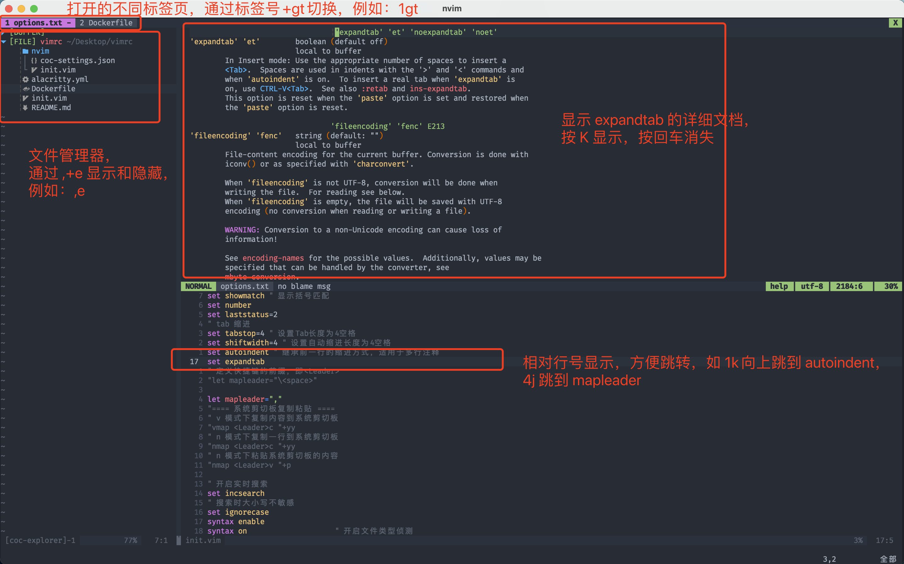
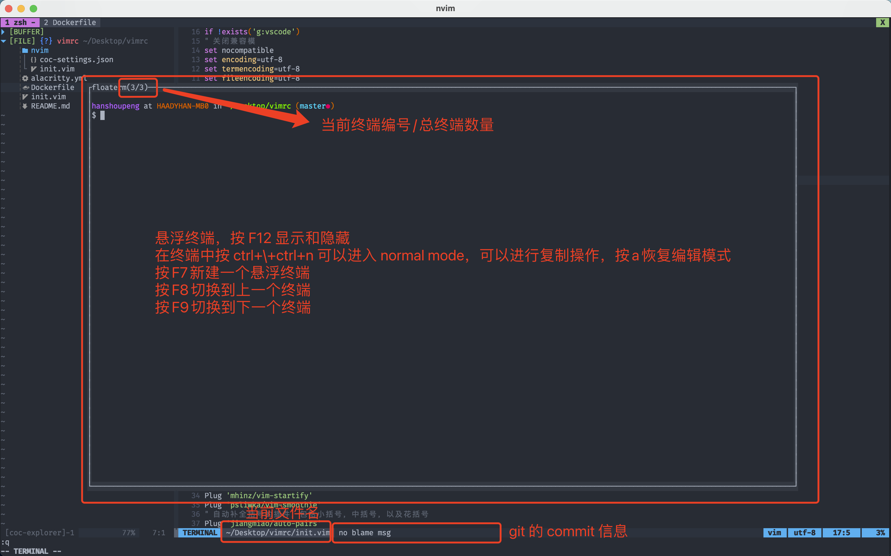

# vimrc

具体的软件安装以及配置可以参考我的[DockerFile](https://github.com/crazyStrome/vimrc/blob/master/Dockerfile)

vim配置，使用vim-plug管理,配置golang开发环境，包括文件树，跳转，补全，悬浮窗口。

repo中的init.vim用于neovim配置。

## alacritty 安装及配置

alacritty 是一个终端模拟器，可以开GPU加速，所以搭配 vim 非常丝滑，比 iterm2 都要快很多。

安装方法见[alacritty安装](https://zhuanlan.zhihu.com/p/345579588)

配置就是执行：

```bash
cp alacritty.yml ~/.alacritty.yml
```

当前配置中使用了 FiraCode Nerd Font 字体，需要安装该字体才能正常显示。[Installing · tonsky/FiraCode Wiki · GitHub](https://github.com/tonsky/FiraCode/wiki/Installing)

然后 alacritty 就配置好了。

## neovim安装

参考：

[Neovim+Coc.nvim配置 目前个人最舒服终端编辑环境(Python&C++)](https://www.cnblogs.com/cniwoq/p/13272746.html)

centos 7仓库中的neovim版本太低，因此需要自己下载安装最近版本的neovim。

从[neovim下载地址](https://github.com/neovim/neovim/releases)下载最新的tar文件，例如nvim-linux64.tar.gz，使用tar指令解压缩到一个目录：

```bash
tar -vxf nvim-linux.tar.gz /usr/local
mv /usr/local/nvim-linux /usr/local/nvim
cd /usr/bin
sudo su
ln -s /usr/local/nvim/bin/nvim nvim
```

这样就建立了一个nvim的链接，在控制台上输入nvim就可以直接打开nvim了。

## vim-plug等配置

见教程[plug配置教程](https://pokitpeng.github.io/posts/linux/vim%E6%89%93%E9%80%A0golang%E5%BC%80%E5%8F%91%E7%8E%AF%E5%A2%83/)

[coc.nvim配置](https://zhuanlan.zhihu.com/p/102306124)

执行如下指令，克隆我的vim配置：

```bash
git clone https://github.com/crazyStrome/vimrc
cd vimrc/
cp init.vim ~/.config/nvim/init.vim
```

然后在控制台上输入如下指令安装vim-plug，它用来管理我们的插件。

```bash
curl -fLo ~/.config/nvim/autoload/plug.vim --create-dirs https://raw.githubusercontent.com/junegunn/vim-plug/master/plug.vim
```

在控制台上输入nvim，然后依次输入

```
:PlugInstall
:GoInstallBinaries
:CocInstall coc-go coc-json coc-yaml coc-protobuf coc-explorer coc-git
```

接下来继续输入：

```bash
:CocConfig
```

然后粘贴如下配置：

```json
{
  "languageserver": {
    "go": {
      "command": "gopls",
      "rootPatterns": ["go.mod"],
      "trace.server": "verbose",
      "filetypes": ["go"]
    }
  },
  "coc.preferences.formatOnSaveFiletypes": [
    "go"
  ],
  "explorer.icon.enableNerdfont": true,
  "explorer.icon.source": "nerdfont.vim",
  "go.goplsOptions": {
    "completeUnimported": true
  },
  "go.goplsUseDaemon": true,
  "hover.floatConfig": {
      "border": true
  },
  "hover.target": "float"
}
```

当前 nvim 配置中使用了 coc-explorer，它需要使用 nerdfont 才能显示图标。这在前面的 alacritty 中有安装的方法，再贴一遍：[Installing · tonsky/FiraCode Wiki · GitHub](https://github.com/tonsky/FiraCode/wiki/Installing)

到这里，nvim基本就可以用了。





其他快捷键：

Ctrl+]代码跳转，Ctrl+o或t代码跳回。

gd跳转到定义处，gr跳转到引用处

K打开当前变量或函数的描述。

Ctrl+n在insert模式中选择下一个补全项，反向使用Ctrl+p

剩下的看init.vim吧。

有问题提issue，随时更

## 已经配置好的docker镜像

环境centos
安装完docker，执行

```bash
docker pull crazystrome/centos:nvim
```

就把我的镜像拉下来了。

我的DockerFile也放在这里[DockerFile](https://github.com/crazyStrome/vimrc/blob/master/Dockerfile)

如果你们是其他的环境，也可以在此基础上修改。
